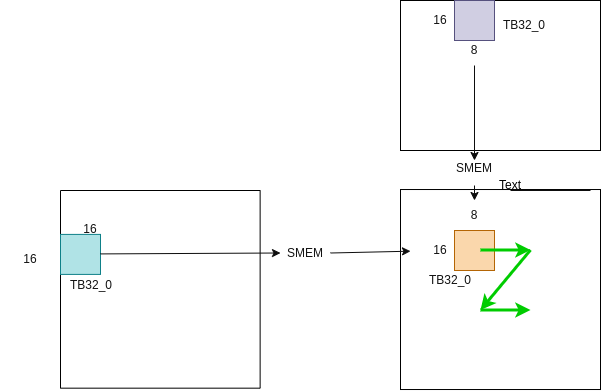

# GEMM Benchmark

### Memory Access Trick of Bag

- [x] float4/uint4
- [x] ThreadBlock Swizzle
- [ ] WrapBlock Swizzle
- [ ] load-matrix
- [ ] async_copy

### Computing Trick of Bag

- [x] Double buffer

For M,N >>> INF, K = 16, cublas TB=128.

### V1

design: 

benchmark: 