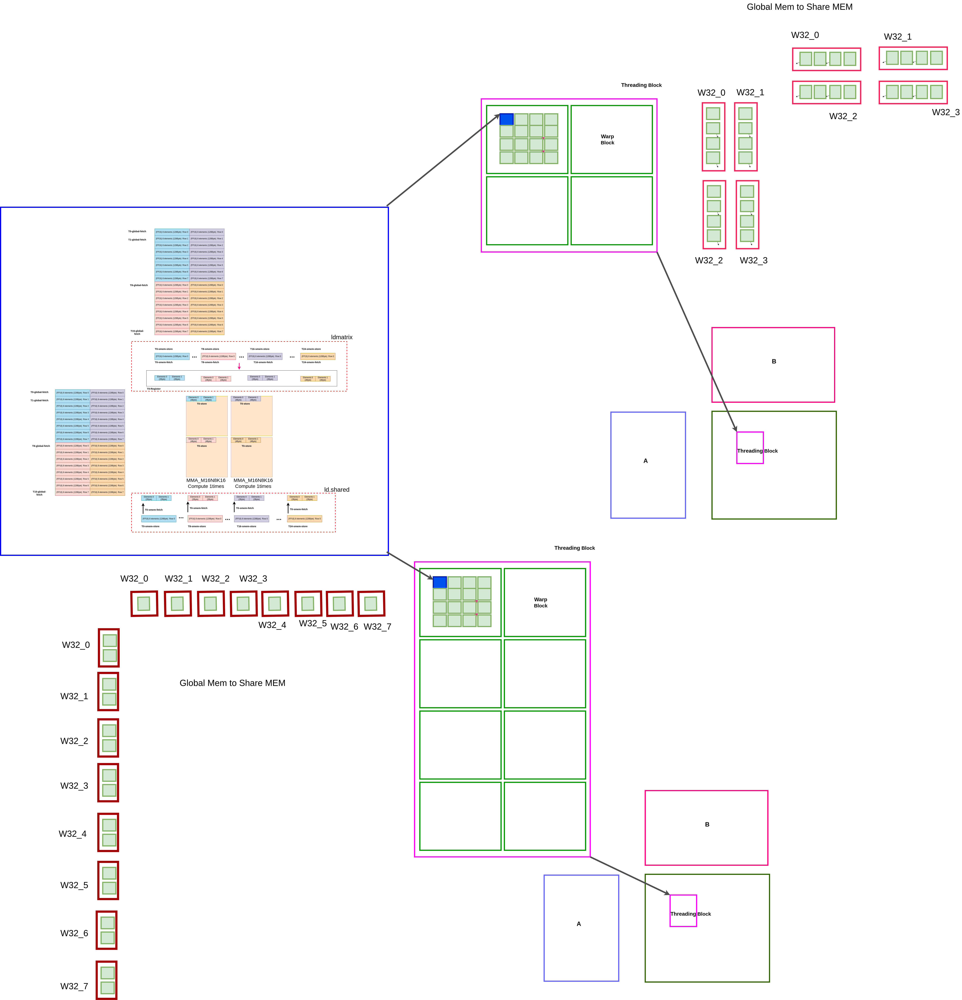
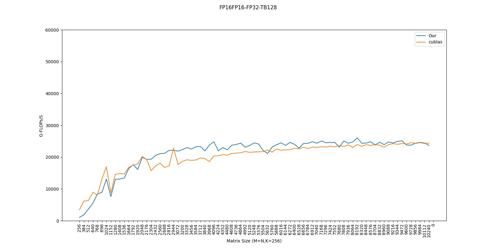
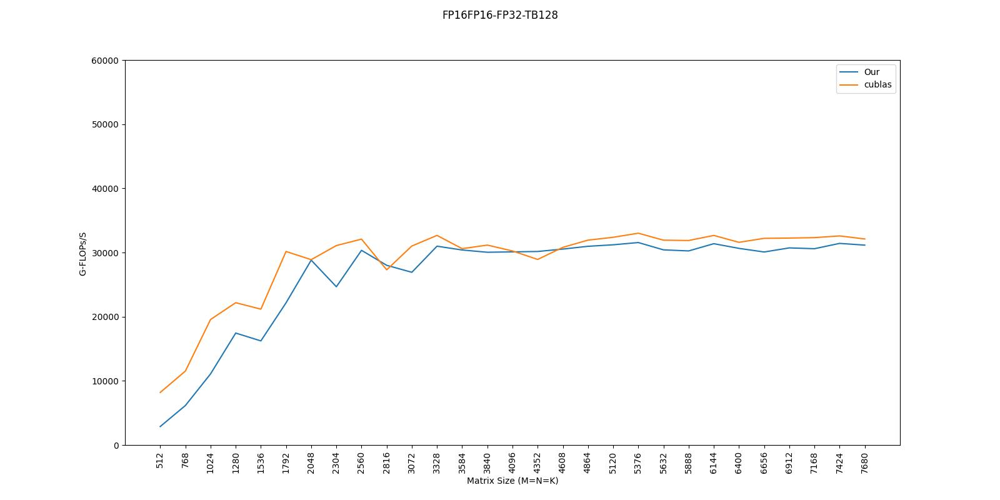

# GEMM Benchmark

### Memory Access Trick of Bag

- [x] float4/Uint4
- [x] ThreadBlock Swizzle
- [x] WrapBlock Swizzle
- [x] Load Matrix
- [x] Async Copy
- [x] Share Mem Bank Free

### Computing Trick of Bag

- [x] MultiStage Buffer

### TB128 & TB256

**design**: 

**benchmark**: 
- Device: GTX3080TI
- CUDA Version: 11.8

